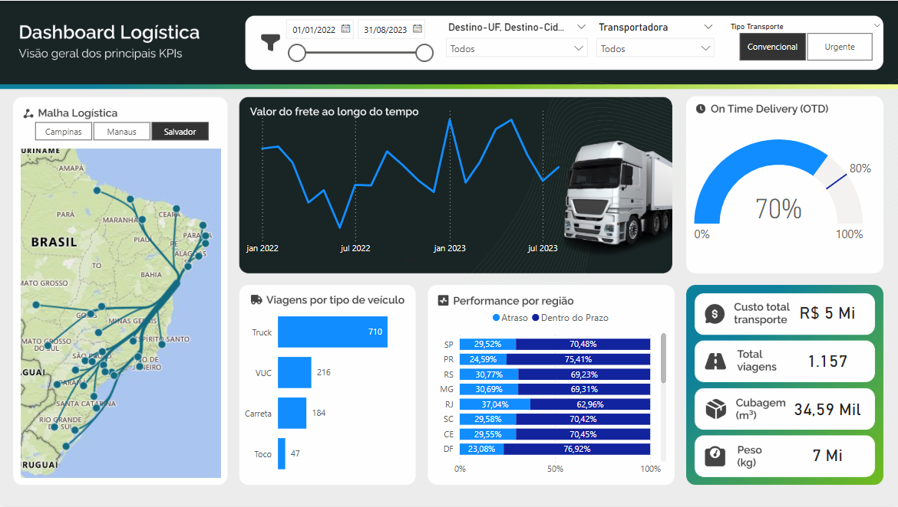
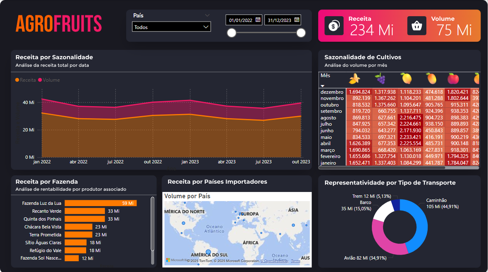
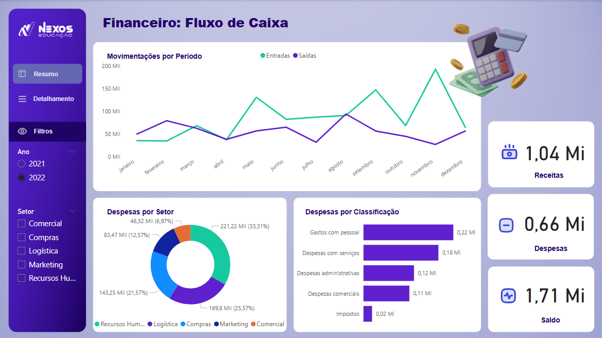

# BI_imersaoNexus

Durante a imersão promovida pelo curso DataDriven, ministrado por **Leicia Ismirile** e **Karina Lagos**, foram desenvolvidos três dashboards temáticos, cada um abordando uma área estratégica dentro do contexto empresarial. O objetivo foi aplicar, na prática, conceitos de visualização de dados, modelagem e construção de indicadores em Power BI. Abaixo, seguem os painéis desenvolvidos:

---

## 📊 Dashboards
### Logística
Este painel apresenta uma visão geral dos principais KPIs logísticos, como:
- Malha de distribuição por cidade.
- Valor do frete ao longo do tempo.
- Quantidade de itens vendidos**: volume total de produtos vendidos.
- Indicadores como On Time Delivery (OTD), total de viagens, custo logístico, cubagem e peso transportado.
- Desempenho por região (atraso vs. dentro do prazo).
- Distribuição por tipo de veículo.
- O dashboard permite análise detalhada por período, destino e tipo de transporte (Convencional/Urgente).
### Agrofruits (Vendas)
Focado na performance comercial de uma empresa do setor agrícola, este painel traz:
- Receita e volume de vendas por sazonalidade.
- Receita por fazenda produtora.
- Distribuição de volume por país importador.
- Análise por tipo de transporte utilizado.
- Tabela dinâmica com a sazonalidade de cultivos por mês e tipo de fruta.
- O painel facilita a identificação de períodos de maior produção e melhores desempenhos logísticos e comerciais.
### Financeiro: Fluxo de Caixa
Este painel apresenta o controle financeiro por meio da análise de:
- Entradas e saídas mensais.
- Receitas, despesas e saldo acumulado.
- Despesas por setor (RH, Logística, Compras, etc.).
- Despesas por classificação (gastos com pessoal, serviços, impostos, etc.).
- Com filtros por ano e setor, o painel permite uma visão clara da saúde financeira da organização.

---

## 🗂️ Base de Dados
- Excel
- CSV

---

## 🛠️ Ferramentas Utilizadas
- Microsoft Power BI**: desenvolvimento dos dashboards interativos.
- Microsoft Excel**: apoio na manipulação e organização dos dados brutos.
- DAX e Power Query**: criação de medidas, colunas calculadas e transformação dos dados.

---

## 📈 Resultados

- **Logística**

- **Vendas**

- **Análise Financeira**

---

### 👩‍💻 Contato

Estou disponível para propostas de emprego, auditorias de dados ou projetos relacionados à análise e visualização de dados. 
Todos os meus contatos estão disponíveis na minha página inicial do GitHub: [beto86](https://github.com/beto86). 
Sinta-se à vontade para visitar e entrar em contato!

